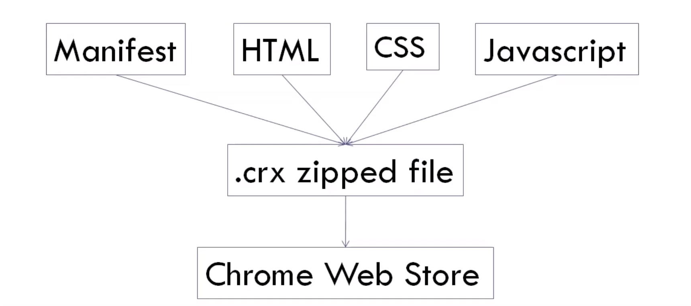

# Create Chrome Browser Extension
**Hi! I am _Aman Raj_. This is a repository where you can learn how to make chrome extension easily.**

<br>

### Prerequisites

<br>

So before we start let's discuss What are the __types of chrome extension__ you can make :
<br>
  * Browser Action - Stay in tool bar accesible all time
  * Page Action - Stay in tool bar but grey-ed out. Accesible only on certain pages.
  * Neither Browser action or Page action. Run in background.
<br>

Extension components are created using these web development technologies :
<br>
  * Manifest ( JSON format )
  * HTML
  * CSS
  * JavaScript
  * Sometimes bootstrap and jQuery also.
<br>



<br>

These files combines to make a package of .crx format zip file which can be uploaded to chrome web store.

<br>


### Lest's Begin

> First you have to create a `manifest.json` file. The directory holding the `manifest file` can be added as an extension in developer mode in its current state. This file should contain these 4 things : 

 * "name" : tells about name of your extension. 
 * "version" : tells about version of your Extension as you will publish changes later on in future. 
 * "description" : this will be available in discription section in chrome web store. 
 * "manifest_version" : Developers should specify which version of the manifest specification their package targets by setting a manifest_version key in their manifests. 


**manifest.json**

```
{
    "name": "Hello World Extension",
    "version": "1.0",
    "description": "First chrome extension",
    "manifest_version": 2
}
```

> Secondly create a `popup.html` file. This will give structure to your new static extension. You can add `.css` and `.js` file to make it beutiful and dynamic.


**HTML**

```
<!DOCTYPE html>
<html lang="en">
<head>
    <meta charset="UTF-8">
    <title>Chrome Extension</title>
    <script src="popup.js"></script>
    <link rel="stylesheet" href="style.css">
</head>
<body>
    <h2 id="greet">Hi this is an extension</h2>
</body>
</html>
```

**CSS**

```
body {
    background: bisque;
}

h2 {
    color: brown;
}
```

So we have created our first extension and now we want to see how it looks.

Let's see how to run this extension on chrome.

<br>

### Installation

1. To test it out, go to `chrome://extensions`.
2. Enable Developer Mode by clicking the toggle switch next to `Developer mode`.
3. Click the `LOAD UNPACKED` button and select the extension directory.

**Congratulations you have just created a basic chrome extension** 🎉🎊 .

